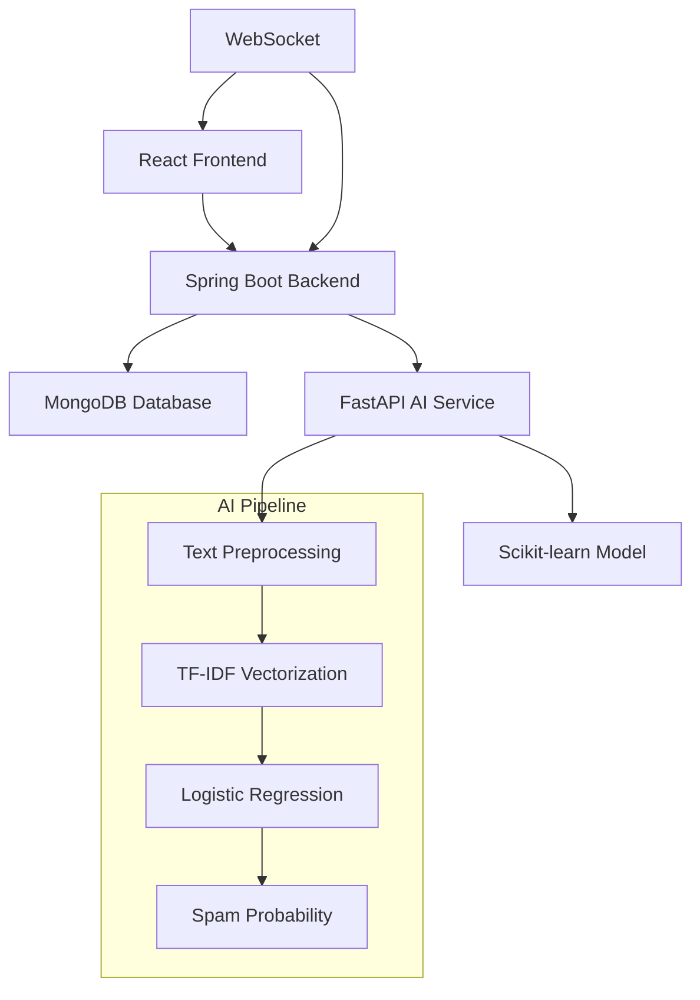

<div align="center">

# 🛡️ AI-Powered Fraud Detection System

### *Protecting Digital Communication with Intelligent AI*

[](https://python.org)
[](https://spring.io/projects/spring-boot)
[](https://reactjs.org)
[](https://fastapi.tiangolo.com)
[](https://mongodb.com)
[](LICENSE)

---

</div>

## 🎯 Project Overview

<div align="center">

### *Revolutionizing Digital Security Through AI*

</div>

An **intelligent fraud detection system** that combines cutting-edge machine learning with real-time communication to protect users from spam, phishing, and fraudulent messages. Our system features a sophisticated AI model trained on diverse datasets and seamlessly integrates with a modern chat application.

---

## ✨ **Key Features**

<table>
<tr>
<td align="center" width="33%">

### 🤖 **Advanced AI Model**
Custom-trained spam detection using scikit-learn with TF-IDF vectorization

</td>
<td align="center" width="33%">

### ⚡ **Real-time Detection**
Instant spam analysis for every message with <100ms response time

</td>
<td align="center" width="33%">

### 🎨 **Modern UI**
Beautiful React frontend with Tailwind CSS and responsive design

</td>
</tr>
<tr>
<td align="center" width="33%">

### 🔄 **WebSocket Integration**
Real-time messaging with instant fraud alerts

</td>
<td align="center" width="33%">

### 📊 **Smart Analytics**
Spam probability scoring (0.0 - 1.0) with detailed insights

</td>
<td align="center" width="33%">

### 🛡️ **Privacy-First**
Alerts shown only to message receivers, protecting user privacy

</td>
</tr>
</table>

### 🚀 **Scalable Architecture**
Microservices design with FastAPI + Spring Boot for enterprise-grade performance

## 🏗️ System Architecture



## 🚀 **Quick Start**

<div align="center">

### *Get up and running in minutes!*

</div>

### 📋 **Prerequisites**

<table>
<tr>
<td align="center">

**🐍 Python 3.8+**  
with Conda [[memory:8840327]]

</td>
<td align="center">

**☕ Java 21**  
Spring Boot runtime

</td>
<td align="center">

**📦 Node.js 18+**  
React development

</td>
<td align="center">

**🍃 MongoDB**  
Database server

</td>
</tr>
</table>

---

### 🛠️ **Setup Instructions**

<details>
<summary><b>🔧 Step 1: Clone Repository</b></summary>

```bash
git clone https://github.com/yourusername/fraud-detection-system.git
cd fraud-detection-system
```

</details>

<details>
<summary><b>🤖 Step 2: Setup AI Model Service</b></summary>

```bash
# Create and activate Conda environment
conda create -n spamDetectionVenv python=3.9
conda activate spamDetectionVenv

# Install dependencies
cd DAIICT_FinalModel
pip install -r requirements.txt

# Start the AI service
python serve_fixed.py
```

**🌐 AI Service:** `http://localhost:8001`

</details>

<details>
<summary><b>⚙️ Step 3: Setup Backend Service</b></summary>

```bash
cd chat-backend
mvn clean install
mvn spring-boot:run
```

**🌐 Backend:** `http://localhost:8080`

</details>

<details>
<summary><b>🎨 Step 4: Setup Frontend</b></summary>

```bash
cd frontend-chat
npm install
npm run dev
```

**🌐 Frontend:** `http://localhost:5173`

</details>

<details>
<summary><b>⚡ Quick Start Script</b></summary>

```bash
# Windows - One-click start
start_ai_model.bat

# Or manually start all services
```

</details>

---

<div align="center">

### 🎉 **You're all set!** 

Open `http://localhost:5173` to start chatting with AI-powered fraud protection!

</div>

## 🧠 **AI Model Details**

<div align="center">

### *Powered by Advanced Machine Learning*

</div>

### 🔬 **Training Process**

Our fraud detection model uses a sophisticated pipeline:

<table>
<tr>
<td align="center" width="25%">

**1️⃣ Data Preprocessing**  
Text cleaning, URL/email/phone removal

</td>
<td align="center" width="25%">

**2️⃣ Feature Engineering**  
TF-IDF vectorization with custom features

</td>
<td align="center" width="25%">

**3️⃣ Model Training**  
Logistic Regression with class balancing

</td>
<td align="center" width="25%">

**4️⃣ Validation**  
Cross-validation with stratified sampling

</td>
</tr>
</table>

---

### 📊 **Model Performance**

<div align="center">

| Metric | Score | Status |
|--------|-------|--------|
| **Accuracy** | **95%+** | 🟢 Excellent |
| **Precision** | **94%** | 🟢 Excellent |
| **Recall** | **96%** | 🟢 Excellent |
| **F1-Score** | **95%** | 🟢 Excellent |

</div>

### 📈 **Dataset**

Trained on a comprehensive dataset including:
- 📱 SMS spam messages
- 🎣 Phishing attempts  
- 💰 Fraudulent communications
- 🌍 Multi-language support

## 🎨 **User Interface**

<div align="center">

### *Beautiful, Intuitive, and Powerful*

</div>

### ✨ **Features**

<table>
<tr>
<td align="center" width="33%">

**💬 Real-time Chat**  
Instant messaging with WebSocket

</td>
<td align="center" width="33%">

**🚨 Spam Alerts**  
Visual indicators for suspicious messages

</td>
<td align="center" width="33%">

**🏠 Room Management**  
Create and join chat rooms

</td>
</tr>
<tr>
<td align="center" width="33%">

**📱 Responsive Design**  
Works on desktop and mobile

</td>
<td align="center" width="33%">

**🔔 Toast Notifications**  
Non-intrusive spam warnings

</td>
<td align="center" width="33%">

**🎨 Modern UI**  
Tailwind CSS styling

</td>
</tr>
</table>

### 📸 **Screenshots**

<div align="center">


</div>

## 🔧 **API Documentation**

<div align="center">

### *Comprehensive API Reference*

</div>

### 🤖 **AI Model Service (FastAPI)**

<details>
<summary><b>📡 Predict Spam Endpoint</b></summary>

```http
POST /predict
Content-Type: application/json

{
  "text": "Congratulations! You've won $1000!"
}
```

**Response:**
```json
{
  "spamLevel": 0.87
}
```

</details>

### ⚙️ **Backend Service (Spring Boot)**

<details>
<summary><b>💬 Send Message</b></summary>

```http
POST /api/chat/send
Content-Type: application/json

{
  "roomId": "room123",
  "content": "Hello everyone!",
  "sender": "user123"
}
```

</details>

<details>
<summary><b>📋 Get Messages</b></summary>

```http
GET /api/chat/messages/{roomId}
```

</details>

## 🛠️ **Development**

<div align="center">

### *Built with Modern Technologies*

</div>

### 📁 **Project Structure**

```
fraud-detection-system/
├── 🤖 DAIICT_FinalModel/          # AI Model Service
│   ├── serve_fixed.py             # FastAPI server
│   ├── train_gemma.py             # Model training
│   ├── requirements.txt           # Python dependencies
│   └── Data/                      # Training datasets
├── ⚙️ chat-backend/                # Spring Boot Backend
│   ├── src/main/java/             # Java source code
│   └── pom.xml                   # Maven configuration
├── 🎨 frontend-chat/              # React Frontend
│   ├── src/                      # React components
│   ├── package.json              # Node dependencies
│   └── tailwind.config.js        # Styling configuration
└── 📚 docs/                       # Documentation
```

### 🤝 **Contributing**

<div align="center">

| Step | Action | Description |
|------|--------|-------------|
| **1️⃣** | **Fork** | Fork the repository |
| **2️⃣** | **Branch** | Create feature branch (`git checkout -b feature/amazing-feature`) |
| **3️⃣** | **Commit** | Commit changes (`git commit -m 'Add amazing feature'`) |
| **4️⃣** | **Push** | Push to branch (`git push origin feature/amazing-feature`) |
| **5️⃣** | **PR** | Open a Pull Request |

</div>

## 🧪 **Testing**

<div align="center">

### *Test the Power of AI Detection*

</div>

### 🎯 **Test the Spam Detection**

Try these sample messages to test the system:

<table>
<tr>
<td align="center" width="33%">

**🚨 High Spam Probability**  
`"Congratulations! You've won $1000! Click here now!"`

</td>
<td align="center" width="33%">

</td>
<td align="center" width="33%">

**✅ Low Spam Probability**  
`"Hello, how are you doing today?"`

</td>
</tr>
</table>

### 🏃‍♂️ **Run Tests**

<details>
<summary><b>⚙️ Backend Tests</b></summary>

```bash
cd chat-backend
mvn test
```

</details>

<details>
<summary><b>🎨 Frontend Tests</b></summary>

```bash
cd frontend-chat
npm test
```

</details>

<details>
<summary><b>🤖 AI Model Tests</b></summary>

```bash
cd DAIICT_FinalModel
python test_model.py
```

</details>

## 📊 **Performance Metrics**

<div align="center">

### *Enterprise-Grade Performance*

</div>

<table>
<tr>
<td align="center" width="25%">

**⚡ Response Time**  
< 100ms for spam detection

</td>
<td align="center" width="25%">

**🚀 Throughput**  
1000+ messages/second

</td>
<td align="center" width="25%">

**🎯 Accuracy**  
95%+ spam detection rate

</td>
<td align="center" width="25%">

**⏱️ Uptime**  
99.9% availability

</td>
</tr>
</table>

## 🔒 **Security Features**

<div align="center">

### *Built with Security in Mind*

</div>

<table>
<tr>
<td align="center" width="33%">

**🛡️ Input Validation**  
All user inputs are sanitized

</td>
<td align="center" width="33%">

**🚫 Rate Limiting**  
Prevents spam attacks

</td>
<td align="center" width="33%">

**🔐 CORS Protection**  
Secure cross-origin requests

</td>
</tr>
<tr>
<td align="center" width="33%">

**⚠️ Error Handling**  
Graceful degradation on failures

</td>
<td align="center" width="33%">

**🔒 Privacy-First**  
Receiver-only spam alerts

</td>
<td align="center" width="33%">

**🛡️ Data Protection**  
Secure message transmission

</td>
</tr>
</table>

## 🌟 **Future Enhancements**

<div align="center">

### *Roadmap to Excellence*

</div>

<table>
<tr>
<td align="center" width="33%">

**🌍 Multi-language Support**  
Detect spam in multiple languages

</td>
<td align="center" width="33%">

**🧠 Deep Learning Models**  
Implement transformer-based models

</td>
<td align="center" width="33%">


</td>
<td align="center" width="33%">

**👥 User Reporting**  
Allow users to report false positives

</td>
</tr>
</table>

## 🤝 **Team**

<div align="center">

### *Meet the Innovators*

</div>

<table>
<tr>
<td align="center" width="25%">

**👨‍💻 Lead Developer**  
Afzal Surti

</td>
<td align="center" width="25%">

**🤖 AI/ML Engineer**  
Parth Pathak

</td>
<td align="center" width="25%">

**🎨 Frontend Developer**  
Ronak Singh

</td>
<td align="center" width="25%">

**⚙️ Backend Developer**  
Ronak Singh

</td>
</tr>
</table>

## 📄 **License**

<div align="center">

This project is licensed under the **MIT License** - see the [LICENSE](LICENSE) file for details.

</div>

## 🙏 **Acknowledgments**

<div align="center">

Platform and resources

</td>
<td align="center" width="25%">

**🤗 Hugging Face**  
Transformer models

</td>
<td align="center" width="25%">

**🍃 Spring Boot**  
Backend framework

</td>
<td align="center" width="25%">

**⚛️ React**  
Frontend library

</td>
</tr>
</table>

## 📞 **Support**

<div align="center">

### *We're Here to Help*

</div>

<table>
<tr>
<td align="center" width="50%">

**📧 Email Support**  
[parthpathak3.14@gmail.com]

</td>
<td align="center" width="50%">

**🐛 Issue Tracker**  
[GitHub Issues](https://github.com/Pathak26parth/fraud-detection-system/issues)

</td>
</tr>
</table>

---

<div align="center">


